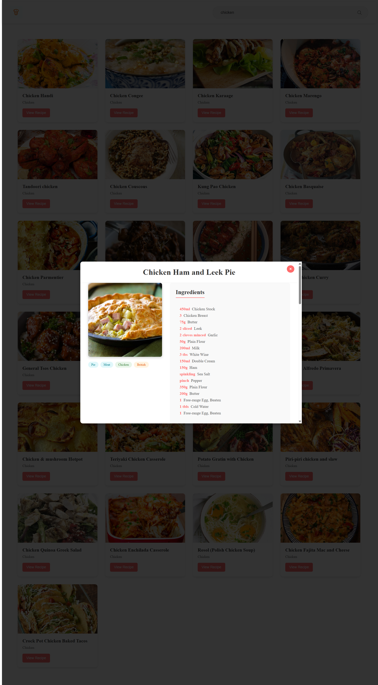

# 🍽️ Food Recipe Finder

A modern React application to discover recipes from all around the world. Simply search for a dish, and explore ingredients, instructions, categories, and even tutorial videos — all powered by [TheMealDB API](https://www.themealdb.com/).

---

## 🌟 Features

- 🔍 **Live Search** — Instantly find meals by name
- 🖼️ **Recipe Cards** — Beautiful layout with dish images
- 📋 **Detailed View** — Includes:

  - Ingredient list with accurate measurements
  - Step-by-step cooking instructions
  - Embedded YouTube tutorial (when available)
  - Category and origin of the dish

- ⚡ **Loading State** — Smooth UX while fetching data
- 📱 **Fully Responsive** — Optimized for desktop and mobile

---

## 🚀 Live Demo

[](https://food-recipe-app.vercel.app)

---

## 📸 Screenshots

| Search Page                         | Recipe Details                       |
| ----------------------------------- | ------------------------------------ |
|  |  |

---

## 🛠️ Tech Stack

| Technology       | Usage                               |
| ---------------- | ----------------------------------- |
| ⚛️ React         | Frontend with Functional Components |
| 🎨 CSS Modules   | Scoped styling for each component   |
| 🍔 TheMealDB API | Free, open-source meal recipe data  |
| 🚀 Vercel        | Deployment and CI/CD hosting        |
| 🎯 React Icons   | Clean and modern iconography        |

---

## ⚙️ Getting Started

Follow these steps to run the project locally:

```bash
# Clone the repository
git clone https://github.com/bibeklams/Food-Recipe.git

# Navigate into the project directory
cd Food-Recipe

# Install dependencies
npm install

# Start the development server
npm start
```

---

## 🚧 Future Enhancements

- ⭐ Add to favorites or save recipes
- 🌙 Dark mode toggle
- 🌐 Filter by category, origin, or ingredient
- 📜 Recipe sharing options

---

## 👤 Author

**Bibek Tamang**
🔗 [github.com/bibeklams](https://github.com/bibeklams)

---

> Simple. Delicious. Discoverable. Powered by React and TheMealDB API.
